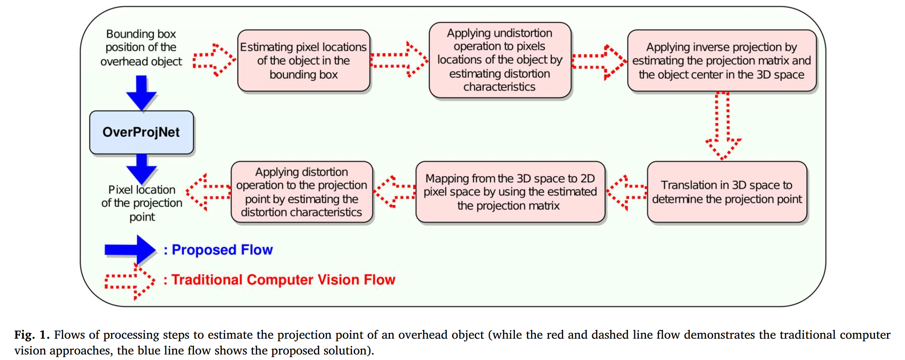
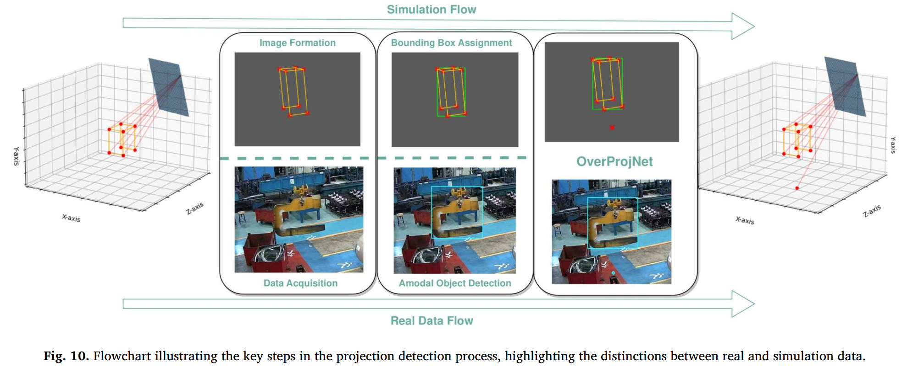

# Overhead object projector: OverProjNet
### OverProjNet is simple, fast and reliable estimator for projection points of overhead objects. 

This repo is used to train and test projection points of overhead objects from images. In addition to that, simulation samples can be generated in the desired configuration.

> [**Overhead object projector: OverProjNet**](https://www.sciencedirect.com/science/article/pii/S2667305323000947)
> 
> [Poyraz Umut Hatipoglu](mailto:poyraz@intenseye.com?subject=OverProjNet), [Ali Ufuk Yaman](mailto:ufuk@intenseye.com?subject=OverProjNet), [Okan Ulusoy](mailto:okan@intenseye.com?subject=OverProjNet)
> 
> News: (08. 2023) Our paper is accepted by Intelligent Systems with Applications: https://doi.org/10.1016/j.iswa.2023.200269 

## Highlights
- Overhead object projection is a challenge without camera matrix & depth estimation.
- Challenges in traditional computer vision solutions are overcome by OverProjNet.
- OverProjNet infers latent relationships between 2D image plane and 3D scene space.
- Developed simulation tool can generate 2D pixel coordinates of overhead objects.
- Datasets are produced and released to validate the effectiveness of OverProjNet.

<p align="left"></p>

## Abstract
Despite the availability of preventive and protective systems, accidents involving falling overhead objects, particularly load-bearing cranes, still occur and can lead to severe injuries or even fatalities. Therefore, it has become crucial to locate the projection of heavy overhead objects to alert those beneath and prevent such incidents. However, developing a generalized projection detector capable of handling various overhead objects with different sizes and shapes is a significant challenge. To tackle this challenge, we propose a novel approach called **OverProjNet**, which uses camera frames to visualize the overhead objects and the ground-level surface for projection detection. **OverProjNet** is designed to work with various overhead objects and cameras without any location or rotation constraints. To facilitate the design, development, and testing of **OverProjNet**, we provide two datasets: _CraneIntenseye_ and _OverheadSimIntenseye_. _CraneIntenseye_ comprises actual facility images, positional data of the overhead objects, and their corresponding predictions, while _OverheadSimIntenseye_ contains simulation data with similar content but generated using our simulation tool. Overall, **OverProjNet** achieves high detection performance on both datasets. The proposed solution's source code and our novel simulation tool are available at https://github.com/intenseye/overhead_object_projector. For the dataset and model zoo, please email the authors requesting access at https://drive.google.com/drive/folders/1to-5ND7xZaYojZs1aoahvu6BkLlYxRHP?usp=sharing.

<p align="left"></p>


## Installation
```
conda create -n overhead_object_projector python=3.8
conda activate overhead_object_projector
sh install.sh 
```

## Data Sample Generation
Data sample generation ability is used to generate data samples that include the position of an overhead object and its projection point in an image. It is designed to simulate scenarios where an object is observed by a camera and its location and projection point are recorded. The script includes functionalities for camera projection, object transformation, and adding random deviations to the data.

#### Usage

- Run the following commands to generate simulation samples. Please see the settings file for the explanation of the sample generation parameters.

```
python sample_generation.py --settings_path /path/to/the/settings.ini/file
```

- sample_generation.py generates data samples by varying object position, rotation, and applying random deviations depending on the set parameters.
- sample_generation.py also optionally exports the data samples, including images and coordinates, to an output folder.
- sample_generation.py also displays images and object positions when drawing or demo modes are enabled.


## Helper Abilities

### Data Splitting Script

The Data Splitting Script is used to split a dataset into training, validation, and test subsets with the given ratios.

#### Usage

- Run the following command to split your dataset:

```
python helper_scripts/split_dataset.py --data_folder_path /path/to/your/dataset --val_ratio <val_ratio> --test_ratio <test_ratio> --train_ratio <train_ratio>
```

- split_dataset.py will create a new directory named "split" within your dataset folder and organize the data into three JSON files: coordinates_train.json, coordinates_val.json, and coordinates_test.json.

### Delete Unused Simulation Data Script

The Delete Unused Simulation Data Script is used to clean a dataset by removing unused data and associated JSON fields in any of training, validation and test split. This is helpful when you want to reduce the size of your dataset by removing unnecessary files and metadata.

#### Usage

- Run the following command to delete unused simulation data:

```
python helper_scripts/delete_unused_simulation_data.py --data_folder_path /path/to/your/dataset
```

- delete_unused_simulation_data.py will scan the specified dataset folder and remove unused images and their associated metadata. It will help you clean your dataset by deleting unnecessary files.

### Time and Throughput Measurement Script

The Time and Throughput Measurement Script is used to measure the processing time and throughput of a deep learning model implemented in PyTorch. This script is particularly useful when you want to assess the performance of a model on different network sizes and batch sizes.

#### Usage

- Run the script without any additional arguments. 

```
python helper_scripts/measure_time_throughput.py
```

- measure_time_throughput.py perform time and throughput measurements for various network sizes and batch sizes.


Note: The W&B sweeper produces configurations by considering the ranges and distributions of the hyperparameters and prints 
them to temp_params.py before the training with the decided configuration.


